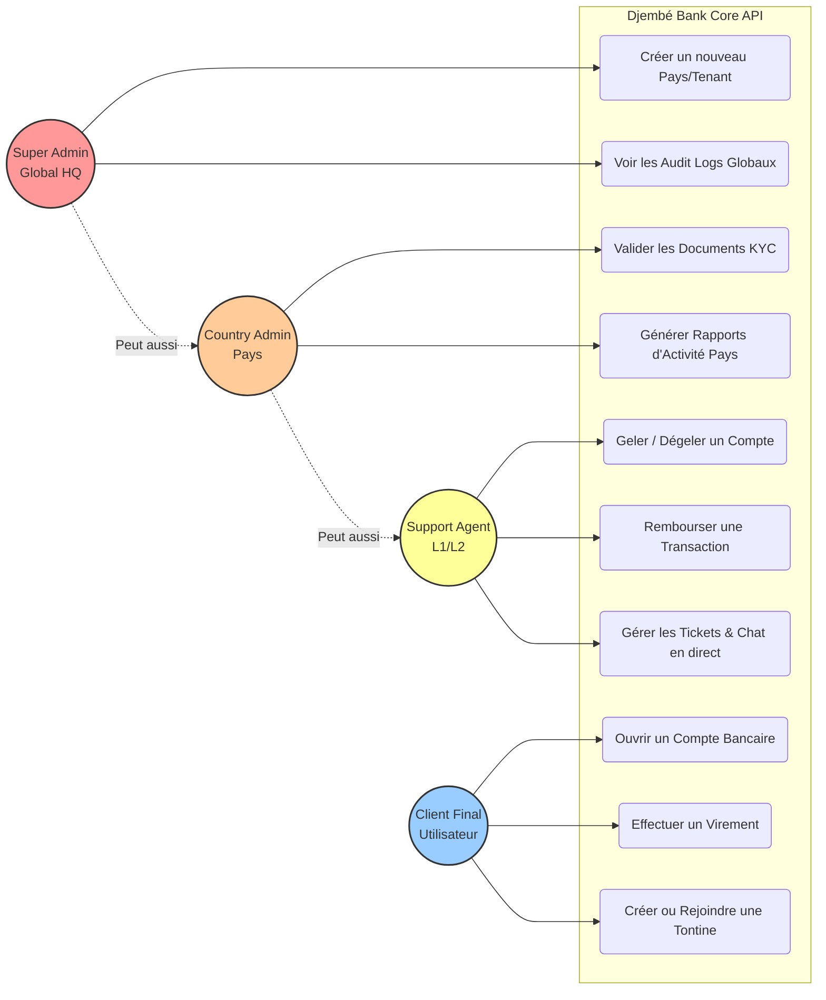
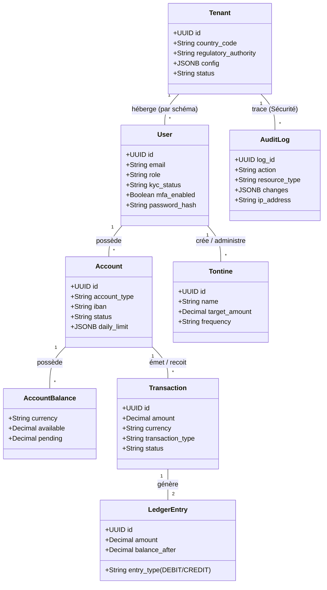
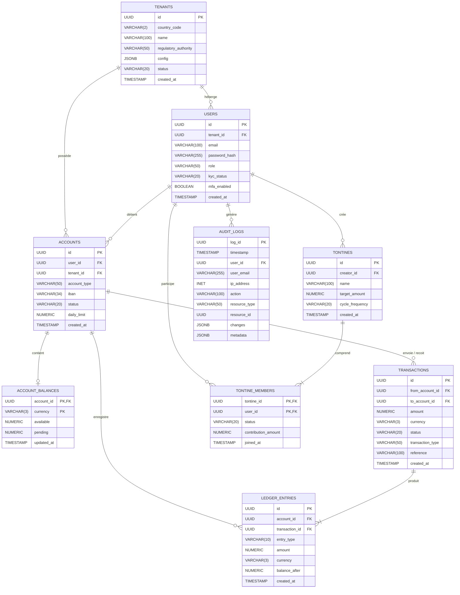

# Diagrammes de Conception - Djembé Bank Core API

Afin d'appuyer votre présentation, voici les deux schémas architecturaux générés au format **Mermaid**. 

> 💡 **Comment les utiliser ?**
> La majorité des éditeurs modernes (sur VS Code, GitHub, GitLab ou Notion) afficheront ces graphes automatiquement. Sinon, vous pouvez copier/coller ces blocs de code sur le site gratuit **[Mermaid Live Editor](https://mermaid.live/)** pour les télécharger directement en image (PNG/SVG) à coller dans votre PowerPoint.

---

## 1. Diagramme de Cas d'Utilisation (Use Case)

Ce diagramme illustre le **Système de Permissions (RBAC)** et prouve la ségrégation des fonctions d'Administration.

---

## 2. Diagramme de Classe (Base de Données / Modèles)

Ce diagramme illustre la solidité de votre moteur bancaire, incluant le `LedgerEntry` (Double-entry bookkeeping) et la `Tontine`.

---

## 3. Modélisation Physique de Données (MPD - ER Diagram)

Ce diagramme Entité-Relation détaille la structure exacte des tables PostgreSQL, leurs types de données (UUID, JSONB, NUMERIC) et les clés primaires/étrangères (PK/FK).

---
### 💡 Points clés pour votre speech :
*   **Sur le Diagramme de Cas d'Utilisation** : Mettez en avant le modèle RBAC (Role-Based Access Control). Un agent support ne peut *voir* que son pays. Seul le *Super Admin* a la vue globale.
*   **Sur le Diagramme de Classes** : Appuyez sur la relation `Transaction -> LedgerEntry`. C'est l'argument ultime pour rassurer les banques et régulateurs sur la traçabilité comptable parfaite du système (Double Entry Bookkeeping).
*   **Sur le MPD (Modélisation Physique de Données)** : Montrez que vous utilisez des `UUID` pour la sécurité (pas d'ID séquentiels facilement devinables), des `NUMERIC` pour l'argent (pour éviter les bugs de virgule flottante) et du `JSONB` pour de la souplesse sur les logs et configurations.
